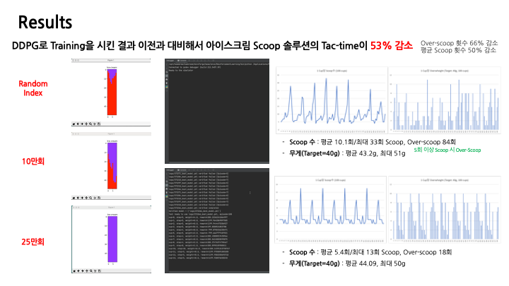

# 아이스크림 자동 스쿱 솔루션
### 강화학습을 사용해 아이스크림을 정량으로 스쿱하는 시뮬레이터 개발

## Concept

#### 카메라와 로봇을 활용해 Ice-cream을 정량으로 Scoop해서 고객에게 제공할 수 있는 무인 솔루션 개발

## Environment

#### 최소한의 시도로 정해진 양만큼의 Ice-cream을 퍼올릴 수 있는 강화학습 System 설계

## Agent

#### Environment의 조건을 고려해 Continouse Action Spaces에서 사용할 수 있는 Q-Learning 방식인 [DDPG](https://arxiv.org/pdf/1509.02971.pdf) 알고리즘 선정

### Continuous Action Spaces
해당 솔루션은 Camera에서 Robot으로 좌표를 전송하는 Simulating을 사용하기 때문에 Continuous action으로 구성했습니다.

### Q-Learning (Off-Policy)
현재의 Policy에만 기인하면(On-policy) 잘못된 경험이 누적되지 않고, 목표에 맞게 최선의 선택을 따를 수 있는 Q-Learning 방식을 사용했습니다.

## Method

#### Statement와 Reward에 대한 개선 조치 후 수렴하지 않던 Policy gradient가 수렴함

### Statement 개선
시계열 정보를 반영하기 위해 잔여 Ice-cream 정보에 Word2Vec으로 사용하는 적층식 LSTM Layer를 적용했으며 해당 [논문](https://arxiv.org/abs/1707.07338) 을 일부 참고했습니다.

### Reward Engineering
Cup 무게 및 잔여 Ice-cream 정보를 Reward로 설계했습니다.

## Results

#### Training 결과 이전에 대비해 Ice-cream Solution의 Tac-time이 53% 감소함
